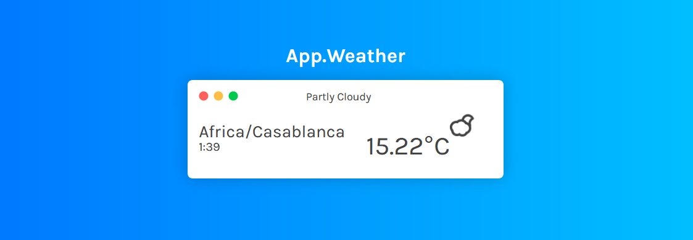

# Weather Widget
> Build a Weather widget with vanilla javascript

The interface of the Weather Widget

## About Weather Widget

I use Vanilla Javascript for this project, is fast & easy, by using https://darksky.net api to pull all the necessary weather information we need, is free '1000 api calls'.
For icons i use [Skycons](https://github.com/darkskyapp/skycons) is Opensource you can get here in github.

## Design

Thanks to [Ann H.](https://codepen.io/merkund/pen/wQrMoB) From codepen.

Distributed under the MIT License. See ``LICENSE`` for more information.
